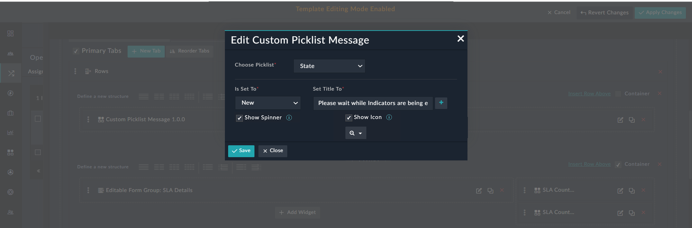
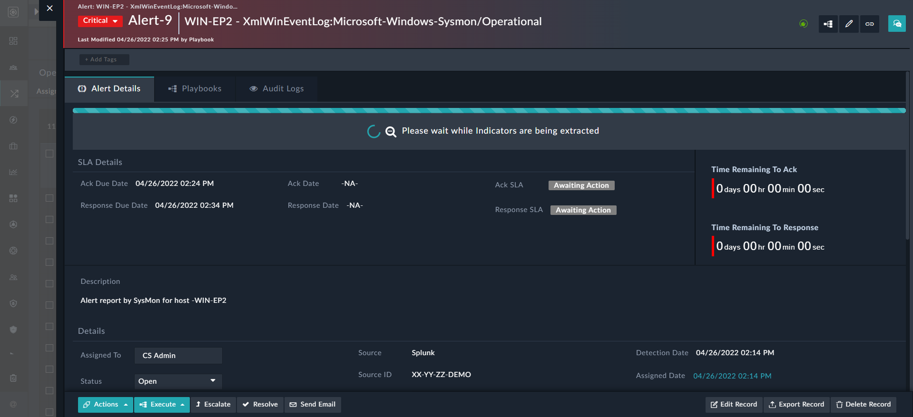

# Custom Picklist Message

Displays custom messages at the top of the detail page of records, based on the values assigned to the different states of a particular picklist. You can use this widget to highlight the state of the record and provide additional contextual information upfront to users.

An example of using the custom picklist message widget would be displaying a custom message such as `Please wait while Indicators are being extracted` when a new alert is added, i.e., the **State** of an alert record is set to **New**.

**Custom Picklist Message Edit View**:

**Custom Picklist Message - Alert Detail view**:

**Certified**: No

**Publisher**: Fortinet  

**Compatibility**: 7.2.0 and higher  

**Applicable**: View Panel

## Custom Picklist Message Settings

Provide the following details to customize the Custom Picklist Message widget to suit your requirements:

| Fields          | Description                              |
| --------------- | ---------------------------------------- |
| Choose Picklist | Select the picklist based on the values of whose options the custom message gets displayed at the top of the records' detail. |
| Is Set to       | Select the option of the picklist, which when set triggers the custom message to get displayed at the top of the records' detail. |
| Set Title To    | Specify the custom message to be displayed when the picklist is set to the option that users have selected. |

