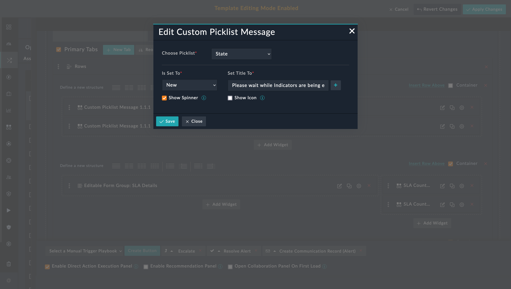

| [Home](../README.md) |
|----------------------|

# Usage

**Custom Picklist Message** widget displays custom messages at the top of a record's detail page, based on the values assigned to the different state of a particular picklist. You can use this widget to highlight the state of the record and provide additional contextual information upfront to users.

An example of using the custom picklist message widget would be displaying a custom message such as the following:

> Please wait while indicators are being extracted

This message appears when a new alert is added, i.e., the *State* of an alert record is set to **New**.

The following image shows this message with a spinner depicting that the status is *in progress*.

## Custom Picklist Message's Edit View

This section helps understand the process of adding the custom picklist message widget for a customized message. For a better understanding, let's recreate the custom message in the preceding example.

1. Click to open an alert.

2. Edit the alert's view template and select **Add Widget** button.

3. Select **Custom Picklist Message** from the list to open the **Custom Picklist Message** widget's customization modal.

4. Select **State** in **Choose Picklist** field.

5. Select **New** in **Is Set to** field.

6. Enter the following message in **Set Title To** field.
    
    > *Please wait while indicators are being extracted*

7. Select the checkbox **Show Spinner** to display a spinner while the extraction is in progress.

8. Select the checkbox **Show Icon** to select and display an icon along with the message.

Now, whenever a *New* alert is created and the indicators are being extracted, this message remains on screen with your chosen icon and spinner.

| [Installation](./setup.md#installation) | [Configuration](./setup.md#configuration) |
|-----------------------------------------|-------------------------------------------|